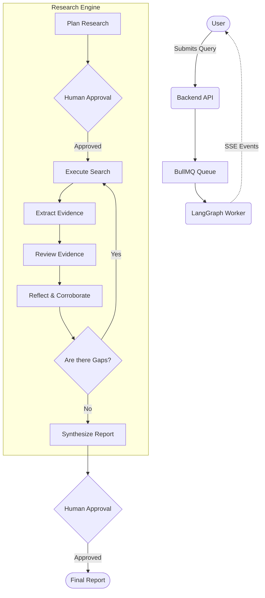

<div align="center">
  <div style="width: 64px; height: 64px; background: rgba(124, 58, 237, 0.15); border: 1px solid rgba(124, 58, 237, 0.25); border-radius: 16px; display: flex; align-items: center; justify-content: center; margin: 0 auto 24px;">
    <svg xmlns="http://www.w3.org/2000/svg" width="32" height="32" viewBox="0 0 24 24" fill="none" stroke="#a78bfa" stroke-width="2" stroke-linecap="round" stroke-linejoin="round"><path d="M9.5 2A2.5 2.5 0 0 1 12 4.5v15a2.5 2.5 0 0 1-4.96.44 2.5 2.5 0 0 1-2.96-3.08 3 3 0 0 1-.34-5.58 2.5 2.5 0 0 1 1.32-4.24 2.5 2.5 0 0 1 1.98-3A2.5 2.5 0 0 1 9.5 2Z"/><path d="M14.5 2A2.5 2.5 0 0 0 12 4.5v15a2.5 2.5 0 0 0 4.96.44 2.5 2.5 0 0 0 2.96-3.08 3 3 0 0 0 .34-5.58 2.5 2.5 0 0 0-1.32-4.24 2.5 2.5 0 0 0-1.98-3A2.5 2.5 0 0 0 14.5 2Z"/></svg>
  </div>
  <h1 align="center">AI Deep Research</h1>
  <p align="center">
    <strong>An autonomous AI research engine that decomposes complex queries, explores the web, cross-checks evidence, and synthesizes comprehensive reports.</strong>
  </p>
  <p align="center">
    <a href="#how-it-works">How it works</a> •
    <a href="#differentiators">Why it's different</a> •
    <a href="#architecture">Architecture</a> •
    <a href="#local-setup">Deployment</a>
  </p>
</div>

<br />

## Overview

AI Deep Research is a **multi-agent reasoning system** designed to solve the cognitive labor of deep, multi-source investigation. Rather than relying on simple Retrieval-Augmented Generation (RAG) which often halts at surface-level summaries, this engine iterates: it plans, searches, reads, extracts exact quotes, evaluates credibility, detects contradictions, and reflects on missing gaps before it considers its job done.

## 🚀 Why It's Different from Ordinary Search/RAG

Most RAG systems fail when faced with complex, multi-faceted questions because they retrieve once and summarize once. AI Deep Research introduces **iterative loops and critical evaluation**:

1. **Multi-Perspective Roles**: Specialized agents operate concurrently. A *Primary Researcher* gathers standard facts, a *Gap Researcher* actively seeks missing angles, and a *Contradiction Analyst* intentionally searches for opposing views to break echo chambers.
2. **Explicit Provenance**: Every claim in the final report is backed by an exact quote and a cited source. It strictly separates *corroborated facts* from *single-source claims*.
3. **Contradiction Detection**: If Source A claims X and Source B claims Y, the engine does not hallucinate a compromise. It flags the contradiction, evaluates source credibility, and clearly presents the nuanced dispute in the final report.
4. **Human-in-the-Loop Workflow**: The system pauses at critical junctures (Plan Approval, Final Report Approval), ensuring the user guides the research direction and verifies AI-generated metrics before accepting the result.

## 🌟 Feature Highlights

* **Multi-Stage LangGraph Engine**: Orchestrates planning, execution, evidence review, and synthesis.
* **Intelligent Reflection**: Evaluates its own findings against the original objective and automatically spawns new follow-up queries if gaps exist.
* **Deterministic Evaluation Metrics**: Scores the session on corroboration rate, single-source rate, and contradiction counts without relying on an opaque "AI score."
* **Real-time SSE Streaming**: The UI renders a live trace of the agent's internal activity and metrics over Server-Sent Events.
* **Production-Grade Background Workers**: Heavy LLM chains execute reliably on a Redis-backed BullMQ queue, entirely decoupled from the REST API.
* **Secure Sharing**: Finalized, human-approved reports can be shared via cryptographic read-only public URLs.

## 🧠 Research Workflow



## 🏗 Architecture & Tech Stack

The platform is designed as a scalable monorepo encompassing a modern web client, a robust REST API, and a decoupled asynchronous background worker.

### Frontend
* **Framework**: React 19 + Vite + TypeScript 5.8
* **Styling**: Tailwind CSS 3, Framer Motion for cinematic micro-interactions.
* **Data Management**: React Router 7, native SSE event ingestion.

### Backend API & Workers
* **Runtime**: Node.js 18+ / Express
* **Agent Framework**: LangGraph.js
* **LLM Engine**: Google Gemini API (structured outputs)
* **Search Provider**: Tavily API
* **Task Queues**: BullMQ + Redis for resilient, crash-safe asynchronous agent runs.
* **Database**: PostgreSQL (via Supabase) with strictly enforced Row Level Security (RLS).

## 🔒 Security & Data Privacy

* **Tenant Isolation**: Row Level Security (RLS) guarantees users can only access their own sessions and data.
* **No Frontend Secrets**: All LLM and Search API calls happen server-side; API keys are never exposed in the client bundle.
* **Strict Validation**: Share tokens are generated securely (no predictable database IDs); authentication routes are heavily rate-limited.

## 🛠 Local Setup

### Prerequisites
* Node.js **18+**
* npm **9+**
* Local Redis Server (or `docker run -p 6379:6379 -d redis`)

### 1. Clone & Configure
```bash
git clone https://github.com/psnacode0508/ai_deep_research.git
cd ai_deep_research
cp .env.example .env
# Fill in GEMINI_API_KEY, TAVILY_API_KEY, SUPABASE keys, and REDIS_URL.
```

### 2. Install & Start
```bash
npm install

# Terminal 1: Backend API
npm run dev:server

# Terminal 2: Background Research Worker
cd apps/server && npm run worker

# Terminal 3: Frontend Web
npm run dev:web
```
The frontend is available at `http://localhost:5173`.

## 🚢 Deployment Architecture

* **Database & Auth**: Supabase (PostgreSQL)
* **API & Worker**: Deployed as two separate scalable services on Render or Railway.
* **Frontend**: Vercel (static site with serverless configuration for routing).
* **Environment Variables**:
  * `FRONTEND_URL`, `SUPABASE_URL`, `SUPABASE_SERVICE_ROLE_KEY`, `DATABASE_URL`, `GEMINI_API_KEY`, `TAVILY_API_KEY`, `REDIS_URL`.

## 🔮 Future Improvements
* Web scraping integration with Playwright for domains behind simple paywalls.
* Fine-tuning a smaller, specialized OSS model (e.g. Llama 3 8B) exclusively for the Evidence Extraction step to lower latency and costs.
* Export integrations directly to Google Drive and Notion.

---
*Built as a showcase for advanced agentic workflow patterns and production-grade TypeScript engineering.*
